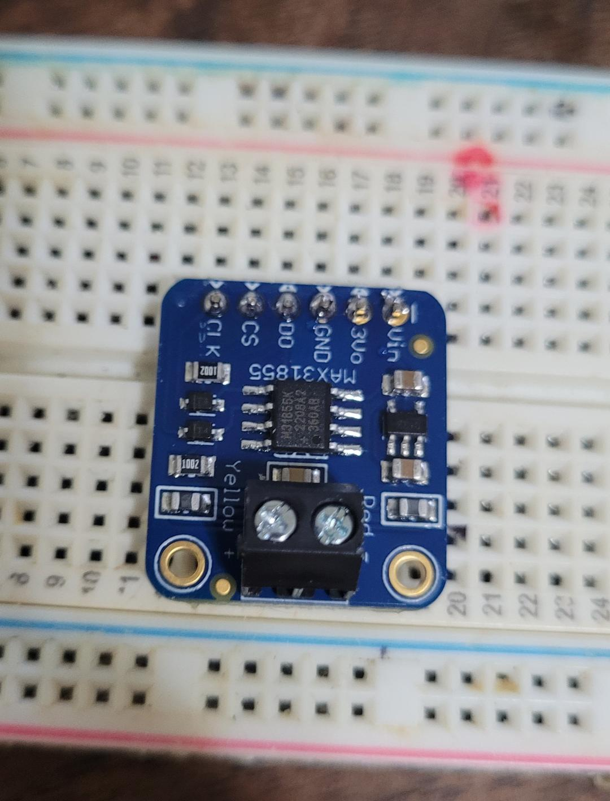
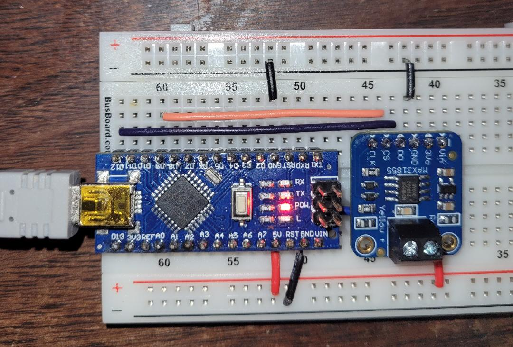

# Thermocouple Attachment and Testing Guide

This document is a compiled guide based on a conversation about how to attach and test a Type-K thermocouple, specifically when using an Adafruit MAX31855 thermocouple amplifier breakout board with an Arduino.

## Attaching a Type-K Thermocouple

Identify the wires:
- Type-K thermocouple wires are typically color-coded.
- The negative wire is usually red, and the positive wire can be yellow or green, depending on the standard.
- In a case where there's only one wire visible, it's typically encased with the other in a single insulation.

Attaching the hot junction:
- The hot junction is the part of the thermocouple that gets exposed to the temperature you want to measure.
- Use thermal compound to improve thermal contact if necessary.
- Be cautious about using thermal compound that can harden or is electrically conductive, especially if you plan to detach and reattach the thermocouple.

Securing the thermocouple:
- Use Kapton tape for attaching the thermocouple to a surface like a transistor. It's heat resistant and leaves minimal residue.
- The adhesive used in Kapton tape is typically a silicone adhesive which can withstand high temperatures.

## Testing the MAX31855 Breakout Board

Connecting the Adafruit breakout board:
- Connect +5V to Vin if the board is 5V compliant.
- Connect GND to ground.
- Connect the SPI pins (CS, SCK, MISO) to the corresponding pins on the Arduino.

Testing for open circuits:
- Use the `readError()` method from the Adafruit MAX31855 library to check for any faults with the thermocouple connections.

## Some components

Not yet connected

Connected to Arduino, breakout board working without thermocouple attached. Correctly displays open circuit error condition

