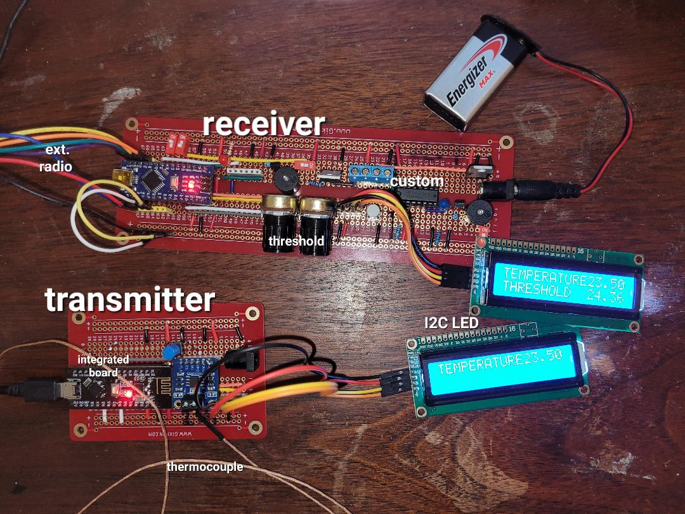

# Thermo55

An alerting system that raises an alarm when the temperature rises above or falls below a set threshold.

*Standalone mode is supported, as in version 2.x. However, some pin assignments have changed, so the hardware is not compatible.*

Additionally, remote monitoring of a separate thermometer module is supported via nRF24L01 radio.

## Software requirements

Install the following libraries into the Arduino IDE:

* LiquidCrystal_I2C
* Adafruit MAX31855 (for thermocouple)
* RF24 library from TMRh20 version 1.4.7 or later

## Hardware requirements

It is possible to run a transmitter and receiver (RX configuration), or standalone.

The Arduino used as receiver (or standalone) must have analog input pins A6, A7 for setting the threshold. We used Nano v3.

You can operate with an external radio, of a Nano v3 + nRF24L01 integrated noard (as illustrated).

You eill also need:
- AdaFruit MAX31855 thermocouple amplifier breakout board (for transmitter)
- Type K thermocouple wire
- LCD 1602 display with I2C capability (for receiver)
- pushbutton switch (for receiver)

Optional:
- 2nd LCD 1602 display and pushbutton switch (for transmitter)

If you don't have an LCD display, the output is also printed to the serial monitor.

## Pin assignments

INPUT_PULLUP pins are active low according to the function described.

If using an external radio, use the pins marked *E*. If using an integrated Nano3/nRF24L01 board, leave these pins unconnected.

There are two SPI buses with separate clocks: One (spi) for the radio, and spi1 for the thermocouple.

**T**: connections for transmitter (thermometer)  
**R**: connections for receiver (monitor)

- X : relevant connection
- N : no connection
- L : connect if LCD used
- E : to external radio if used

| pin  | T  | R  | type         | meaning                        |
|------|----|----|--------------|--------------------------------|
| D2   | N  | X  | OUTPUT       | alert output                   |
| D3   | N  | X  | OUTPUT       | alert output persisted (Note 1) |
| D4   | N  | X  | INPUT_PULLUP | threshold direction (Note 2)   |
| D5   | L  | X  | INPUT_PULLUP | display pushbutton             |
| D6   | L  | X  | INPUT_PULLUP | always-on display              |
| D7   | X  | N  | spi1         | CLK (MAX31855)                 |
| D8   | X  | N  | spi1         | CS  (MAX31855)                 |
| D9   | E  | E  | spi          | CSN (nRF24L01)                 |
| D10  | E  | E  | spi          | CE  (nRF24L01)                 |
| D11  | E  | E  | spi          | MOSI (nRF24L01)                |
| D12  | XE | E  | spi, spi1    | MISO (nRF24L01), DO (MAX31855) |
| D13  | E  | E  | spi          | SCK  (nRF24L01)                |
| A0   | X  | X  | INPUT_PULLUP | enable radio (Note 3)          |
| A1   | X  | X  | INPUT_PULLUP | monitor (receiver) mode        |
| A2   | X  | X  | INPUT_PULLUP | radio power, -2's bit          |
| A3   | X  | X  | INPUT_PULLUP | Celsius display (note 4)       |
| A4   | L  | X  | i2c          | SDA (LCD 1602)                 |
| A5   | L  | X  | i2c          | SCL (LCD 1602)                 |
| A6   | N  | X  | INPUT        | threshold POT (fine)           |
| A7   | N  | X  | INPUT        | threshold POT (coarse)         |

*Note 1:* Pin D3 (alert output persisted) goes HIGH the first time the threshold alert is triggered, and remains HIGH until a long button-press.

*Note 2:* If D4 is jumpered to GND, then the alert occurs on a high-to-low temperature transition. Otherwise, it happens on a low-to-high temperature transition.

*Note 3:* Jumper to GND to enable the radio. Leave unconnected for standalone configuration.

*Note 4:* If A3 is jumpered to GND, then the temperature on the LCD is displayed in degrees F. If left unconnected, the display is in degrees C. The serial monitor output always displays in degrees C.

Operational modes:
| A0  | A1  | mode           | radio? | thermocouple? | threshold POT? |
|-----|-----|----------------|--------|---------------|----------------|
| NC  | NC  | standalone     | no     | yes           | yes            |
| NC  | GND | (unsupported)  |        |               |                |
| GND | NC  | transmitter    | yes    | yes           | no             |
| GND | GND | receiver       | yes    | no            | yes            |

Radio power selection:
| A2  | power   |
|-----|---------|
| NC  | 3 (MAX) |
| GND | 1 (LOW) |

Radio channel is fixed to 113.

Connect GND, +5V, A4, A5 to the LCD display.

### Standalone

This configuration can run on a single board and does not use a radio.

Leave pin A0 unconnected, to disable the radio functionality.

Connect POTs as described under **Receiver module**.

Connect thermocouple as described under **Transmitter module**.

### Receiver module

Connect pin A0 to GND (enables radio.) 

Connect pin A1 to GND (configures as receiver.)

Connect D5 to a normally-open pushbutton switch.

To keep the display permanently on, switch D6 to GND. Unlike other jumpers, this setting has effect in the loop real-time.

Connect A6, A7 to two POTs configured as voltage dividers. A6 is fine adjustment, A7 coarse adjustment. (It is standard to mount the coarse knob to the right of the fine knob.)

To alert when temperature is below the threshold, wire D4 to GND. To alert when temperature is above the threshold, leave D4 unconnected.

Connect output pins D2 (alert) and/or D3 (auxiliary output) in accordance with your use case.

### Transmitter module

Connect pin A0 to GND (enables radio.) 

Leave A1 unconnected (configures as transmitter.)

If using an LCD display, connect D5 to a normally-open pushbutton switch.

Connecting the Adafruit thermocouple amplifier breakout board:

| Arduino | MAX31855 |
----------------------
| +5V | Vin |
| GND | GND |
| D7  | CLK |
| D8  | CS  |
| 12  | DO  |

Identify the thermocouple wires:
- Type-K thermocouple wires are typically color-coded.
- The negative wire is usually red, and the positive wire can be yellow or green, depending on the standard.
- In a case where there's only one wire visible, it's typically encased with the other in a single insulation.

Attaching the hot junction:
- The hot junction is the part of the thermocouple that gets exposed to the temperature you want to measure.
- Use thermal compound to improve thermal contact if necessary.
- Be cautious about using thermal compound that can harden or is electrically conductive, especially if you plan to detach and reattach the thermocouple.

Securing the thermocouple:
- Use Kapton tape for attaching the thermocouple to a surface like a transistor. It's heat resistant and leaves minimal residue.
- The adhesive used in Kapton tape is typically a silicone adhesive which can withstand high temperatures.

## Operation

The LCD initially displays the radio settings for 1 second. Then it switches to display of the temperature and threshold.

The LCD will dim after 10 seconds (unless always-on display is active). To turn on the display, press the button for 1 second.

To activate the max/min display, press and hold the button for 2 seconds.

To reset the max/min values, continue holding or press the button again during the max/min display.
