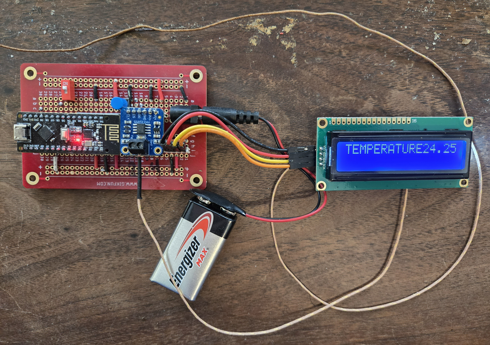
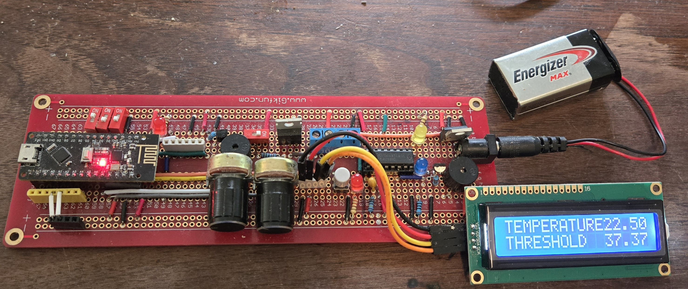

# Thermo55

An alerting system that raises an alarm when the temperature rises above or falls below a set threshold.

Additionally, remote monitoring of a separate thermometer module is supported via nRF24L01 radio.

*Important:* If upgrading from v4.x or lower to v5 or higher, hardware changes are required. Please review the [release notes](v5_relnotes.md).

## Software requirements

Install the following libraries into the Arduino IDE:

* LiquidCrystal_I2C
* Adafruit MAX31855 (for thermocouple)
* RF24 library from TMRh20 version 1.4.7 or later

## Hardware requirements

It is possible to run a transmitter and receiver (RX configuration), or standalone.

The Arduino used as receiver (or standalone) must have analog input pins A6, A7 for setting the threshold. We used Nano v3.

You can operate with an external radio, or a Nano v3 + nRF24L01 integrated board (as illustrated).

You will also need:
- AdaFruit MAX31855 thermocouple amplifier breakout board (for transmitter)
- Type K thermocouple wire
- LCD 1602 display with I2C capability (for receiver)
- pushbutton switch (for receiver)

Optional:
- 2nd LCD 1602 display and pushbutton switch (for transmitter)

If you don't have an LCD display, the output is also printed to the serial monitor.

### Power requirement

USB power may not be sufficient to illuminate bright-white characters on the LCD. If this happens, try switching to external power on Vin, or use a voltage regulator.

## Pin assignments

INPUT_PULLUP pins are active low according to the function described.

If using an external radio, use the pins marked *E*. If using an integrated Nano3/nRF24L01 board, leave these pins unconnected.

There are two SPI buses with separate clocks: One (spi) for the radio, and spi1 for the thermocouple.

| pin  | type         | meaning                        |
|------|--------------|--------------------------------|
| D2   | INPUT_PULLUP | Fahrenheit display (Note 1)    |
| D3   | OUTPUT       | alert output                   |
| D4   | INPUT_PULLUP | threshold direction (Note 2)   |
| D5   | INPUT_PULLUP | display pushbutton             |
| D6   | INPUT_PULLUP | always-on display              |
| D7   | spi1         | CLK (MAX31855)                 |
| D8   | spi1         | CS  (MAX31855)                 |
| D9   | spi          | CSN (nRF24L01)                 |
| D10  | spi          | CE  (nRF24L01)                 |
| D11  | spi          | MOSI (nRF24L01)                |
| D12  | spi, spi1    | MISO (nRF24L01), DO (MAX31855) |
| D13  | spi          | SCK  (nRF24L01)                |
| A0   | INPUT_PULLUP | ensable radio                  |
| A1   | INPUT_PULLUP | monitor (receiver) mode        |
| A2   | INPUT        | hysteresis POT                 |
| A3   | OUTPUT       | alert output, inverted         |
| A4   | i2c          | SDA (LCD 1602)                 |
| A5   | i2c          | SCL (LCD 1602)                 |
| A6   | INPUT        | threshold POT (fine)           |
| A7   | INPUT        | threshold POT (coarse)         |

*Note 1:* The serial monitor output always displays in degrees C.

*Note 2:* If D4 is jumpered to GND, then the alert occurs on a high-to-low temperature transition. Otherwise, it happens on a low-to-high temperature transition.

Operational modes:
| A0  | A1  | mode           | radio? | thermocouple? | threshold POT? |
|-----|-----|----------------|--------|---------------|----------------|
| NC  | NC  | standalone     | no     | yes           | yes            |
| NC  | GND | (unsupported)  |        |               |                |
| GND | NC  | transmitter    | yes    | yes           | no             |
| GND | GND | receiver       | yes    | no            | yes            |

Radio power selection:
| A2  | power   |
|-----|---------|
| NC  | 3 (MAX) |
| GND | 1 (LOW) |

Radio channel is hard-coded to 113. If you need to change this, you can define it at compile time using the symbol `THERMO55_RADIO_CHANNEL`.

Radio device ID is a required arbitrary `LL` value, that is also hard-coded, but can be redefined at compile time using the symbol `THERMO55_DEVICE_ID`.

Connect GND, +5V, A4, A5 to the LCD display.

If operating in Transmitter or Standalone mode, connect GND. +5V, CS, CLK and DO to the Adafruit thermocouple breakout board. Note that the [MAX31855](./MAX31855.md) chip itself is a 3.3V device, but the breakout board has its own 3.3V regulator. The 3.3V (3Vo) output from the breakout board can be left unconnected.

### Standalone

This configuration can run on a single board and does not use a radio.

Leave pin A0 unconnected, to disable the radio functionality.

Connect POTs as described under **Receiver module**.

Connect thermocouple as described under **Transmitter module**.

### Receiver module

Connect pin A0 to GND (enables radio.) 

Connect pin A1 to GND (configures as receiver.)

Connect D5 to GND via a normally-open pushbutton switch, used for selecting and resetting the MAX/MIN display. Also connect D5 to GND via a 100nF (0.1µF) ceramic capacitor; this works with the ATmega's internal pullup resistor and Schmitt-trigger input to debounce the switch.

For Fahrenheit display on the LCD, switch D2 to GND. It does not affect the numbers on the serial monitor, which are always degrees C.

To alert when temperature is below the threshold, switch D4 to GND. To alert when temperature is above the threshold, switch D4 open.

To keep the display permanently on, switch D6 to GND.

Connect output pins D3 (alert) and/or A3 (inverted alert) in accordance with your use case.

Connect A6, A7 to two POTs configured as voltage dividers. A6 is fine adjustment, A7 coarse adjustment. (It is customary to mount the coarse knob to the right of the fine knob.)

Connect A2 to a voltage divider (if using hysteresis), or to GND.

### Threshold and hysteresis

The coarse adjustment ranges from -100 to 300 degrees C. The fine adjustment gives you -10 to 10 degrees on either side in finer steps.

Hysteresis is the number of degrees C that the temperature is allowed to go below (following on-high alarm) or above (following on-low alarm) without turning off the alarm. The range is between 0 and 20 degrees C.

### Transmitter module

Connect pin A0 to GND (enables radio.) 

Leave A1 unconnected (configures as transmitter.)

If using an LCD display, connect D5 to a normally-open pushbutton switch.

To disable thresholds/alerts, connect the coarse threshold to GND (pin A7).

Connecting the Adafruit thermocouple amplifier breakout board:

| Arduino | MAX31855 |
|---------|----------|
| +5V | Vin |
| --  | V3o |
| GND | GND |
| D12 | DO  |
| D8  | CS  |
| D7  | CLK |

Identify the thermocouple wires:
- Type-K thermocouple wires are typically color-coded.
- The negative wire is usually red, and the positive wire can be yellow or green, depending on the standard.
- In a case where there's only one wire visible, it's typically encased with the other in a single insulation.

Attaching the hot junction:
- The hot junction is the part of the thermocouple that gets exposed to the temperature you want to measure.
- Use thermal compound to improve thermal contact if necessary.
- Be cautious about using thermal compound that can harden or is electrically conductive, especially if you plan to detach and reattach the thermocouple.

Securing the thermocouple:
- Use Kapton tape for attaching the thermocouple to a surface like a transistor. It's heat resistant and leaves minimal residue.
- The adhesive used in Kapton tape is typically a silicone adhesive which can withstand high temperatures.

## Operation

The LCD initially displays the radio settings for 1 second. Then it switches to display of the temperature and threshold.

The LCD will dim after 10 seconds (unless always-on display is active). To turn on the display, press the button for 1 second.

To activate the max/min display, press and hold the button for 2 seconds.

To reset the max/min values, continue holding or press the button again during the max/min display.

## Diagnostics

### Radio

If radio is enabled but not connected properly, "RADIO FAULT" is displayed on the LCD. The alarm signal blinks with a frequency of 250 ms. 

### Thermocouple

This applies to transmitter mode with thermocouple breakout board attached. If thermocouple is not connected properly to the breakout board:
- alarm signal blinks with frequency of 500 ms
- LCD displays more detailed error message (open circuit or short)

# Builds

### Transmitter

### Receiver

