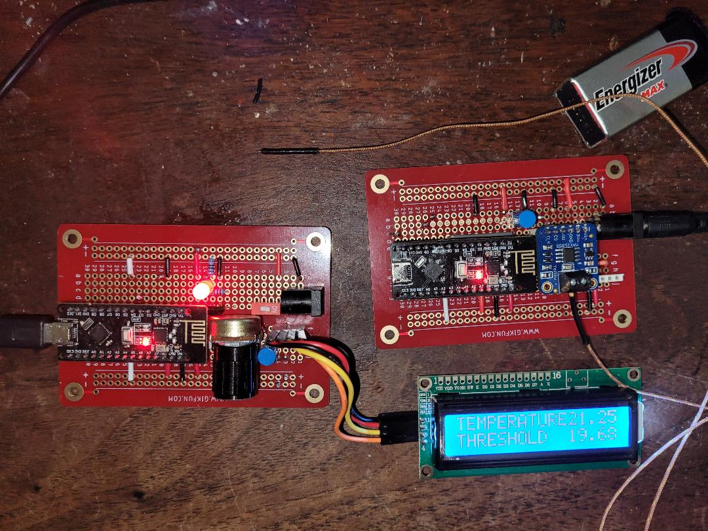

# thermo55

An alerting system that raises an alarm when the temperature rises above or falls below a set threshold.

There are two modules: transmitter (thermometer) and receiver (monitor), communicating via nRF24L01 radio.

## Software requirements

Install the following libraries into the Arduino IDE:

* LiquidCrystal_I2C
* Adafruit MAX31855 (for thermocouple)
* RF24 library from TMRh20 version 1.4.7 or greater

## Hardware requirements

Required:
- 2x Arduino (pref. Nano 3)
- 2x nRF24L01 radio modules (or preferably use 2x Arduino Nano 3 + nRF24L01 integrated boards, as shown)
- AdaFruit MAX31855 thermocouple amplifier breakout board (for transmitter)
- Type K thermocouple wire
- LCD 1602 display with I2C capability (for receiver)
- pushbutton switch (for receiver)

Optional:
- 2nd LCD 1602 display and pushbutton switch (for transmitter)

If you don't have an LCD display, the output is also printed to the serial monitor.

### Pin assignments

If using an external radio, use the pins marked *E*. If using an integrated Nano3/nRF24L01 board, leave these pins unconnected.

There are two SPI buses with separate clocks: One (spi) for the radio, and spi1 for the thermocouple.

- X : connection
- N : no connection
- L : connect if LCD used
- E : to external radio if used

| pin  | T  | R  | type         | meaning                        |
|------|----|----|--------------|--------------------------------|
| D2   | N  | X  | OUTPUT       | alert output                   |
| D3   | N  | X  | OUTPUT       | alert output (inverted)        |
| D4   | N  | X  | INPUT_PULLUP | threshold direction            |
| D5   | L  | X  | INPUT_PULLUP | display pushbutton             |
| D6   | L  | X  | INPUT_PULLUP | always-on display              |
| D7   | X  | N  | spi1         | CLK (MAX31855)                 |
| D8   | X  | N  | spi1         | CS  (MAX31855)                 |
| D9   | E  | E  | spi          | CSN (nRF24L01)                 |
| D10  | E  | E  | spi          | CE  (nRF24L01)                 |
| D11  | E  | E  | spi          | MOSI (nRF24L01)                |
| D12  | XE | E  | spi, spi1    | MISO (nRF24L01), DO (MAX31855) |
| D13  | E  | E  | spi          | SCK  (nRF24L01)                |
| A0   | N  | X  | INPUT        | analog threshold setting       |
| A1   | X  | X  | INPUT_PULLUP | transmitter/receiver selection |
| A2   | X  | X  | INPUT_PULLUP | radio power (LOW/MAX)          |
| A3   | X  | X  | INPUT_PULLUP | radio channel (118 or 113)     |
| A4   | L  | X  | i2c          | SDA (LCD 1602)                 |
| A5   | L  | X  | i2c          | SCL (LCD 1602)                 |

Radio power defaults to MAX. For LOW power, wire A2 to GND.

Radio channel defaults to 118. For 113, wire A3 to GND.

Connect GND, +5V, A4, A5 to the LCD display.

### Receiver module

Connect pin A1 to GND (designates as receiver.)

Connect D5 to a normally-open pushbutton switch.

Connect A0 to a POT configured as a voltage divider.

To alert when temperature is below the threshold, wire D4 to GND. To alert when temperature is above the threshold, leave D4 unconnected.

Connect output pins D2 (alert) and/or D3 (inverted alert) in accordance with your use case.

### Transmitter module

Leave A1 unconnected (designates as transmitter.)

If using an LCD display, connect D5 to a normally-open pushbutton switch.

Connecting the Adafruit thermocouple amplifier breakout board:
- Connect +5V to Vin
- Connect GND to ground
- Connect CLK to pin 7
- Connect CS to pin 8
- Connect DO to pin 12

Identify the thermocouple wires:
- Type-K thermocouple wires are typically color-coded.
- The negative wire is usually red, and the positive wire can be yellow or green, depending on the standard.
- In a case where there's only one wire visible, it's typically encased with the other in a single insulation.

Attaching the hot junction:
- The hot junction is the part of the thermocouple that gets exposed to the temperature you want to measure.
- Use thermal compound to improve thermal contact if necessary.
- Be cautious about using thermal compound that can harden or is electrically conductive, especially if you plan to detach and reattach the thermocouple.

Securing the thermocouple:
- Use Kapton tape for attaching the thermocouple to a surface like a transistor. It's heat resistant and leaves minimal residue.
- The adhesive used in Kapton tape is typically a silicone adhesive which can withstand high temperatures.

## Operation

The LCD initially displays the radio settings for 1 second. Then it switches to display of the temperature and threshold.

The LCD will dim after 10 seconds. To turn on the display, press the button for 1 second.

To activate the max/min display, press and hold the button for 2 seconds.

To reset the max/min values, continue holding or press the button again during the max/min display.
