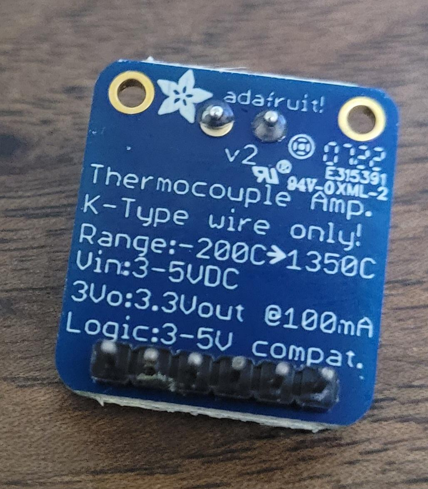
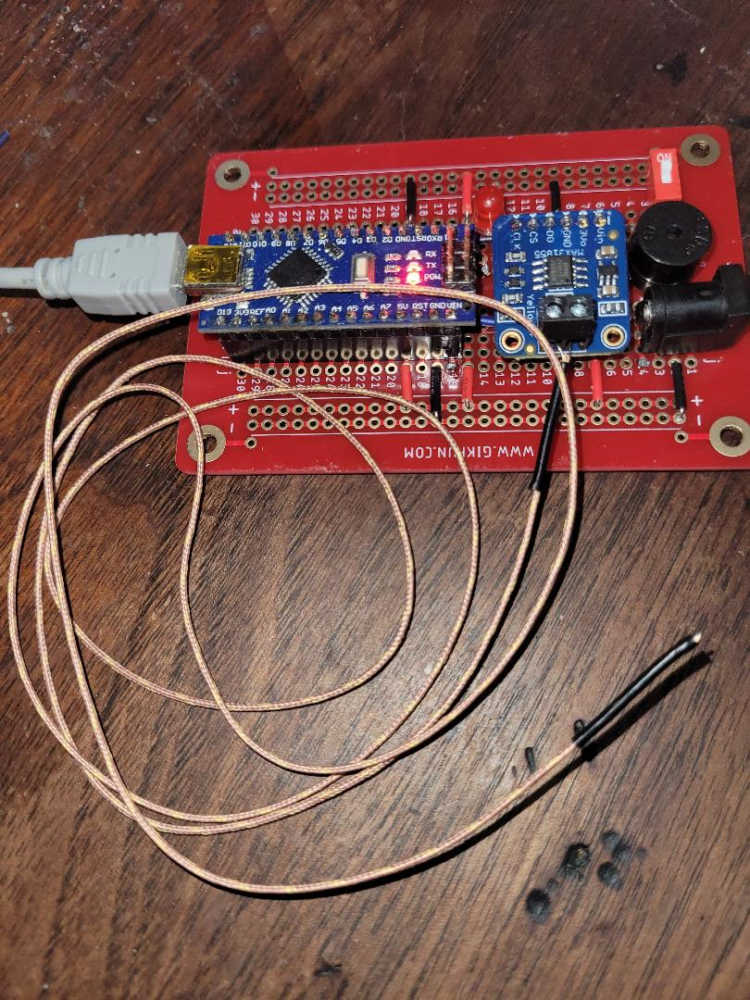
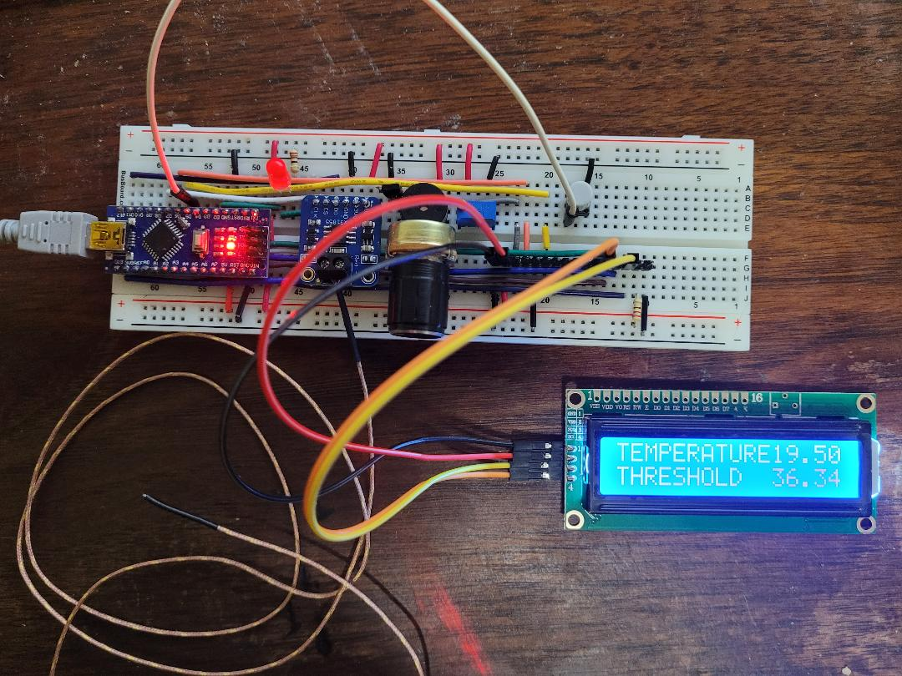
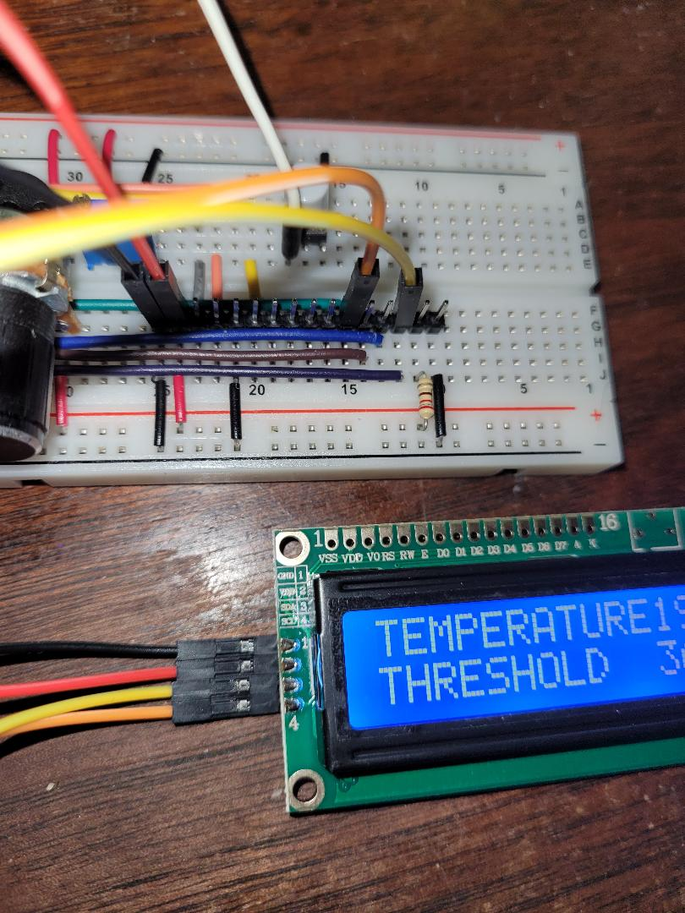

# Temperature Alerting System

An alerting system that sounds an alarm when the temperature rises above (or falls below) a certain threshold. 

## Arduino pin assignments

Note: These are the pin assignments when using the I2C interface to the LCD display. You are on the main branch of this repository. If using the I2S interface, refer to the `parallel_interface` branch.

| pin  | pinMode      | description                         |
|------|--------------|-------------------------------------|
| D2   | OUTPUT       | alert output                        |
| D3   | OUTPUT       | inverted alert output               |
| D4   | INPUT_PULLUP | threshold direction                 |
| D5   | INPUT_PULLUP | display mode                        |
| D8   |              | CS (managed by 31855 driver)        |
| D12  |              | MISO (managed by 31855 driver)      |
| D13  |              | SCK (managed by 31855 driver)       |
| A0   | INPUT        | analog threshold setting            |
| A4   |              | managed by LiquidCrystal_I2C driver |
| A5   |              | managed by LiquidCrystal I2C driver |

## Hardware considerations

You will need:
- Type K thermocouple wire
- AdaFruit MAX31855 thermocouple amplifier breakout board
- LCD 1602 display with I2C capability

If you don't have an LCD display, the output is also printed to the serial monitor.

Connect D5 to a normally-open pushbutton switch. This changes the display from **temperature/threshold** to **max/min** mode.

Connect pin A0 to a POT configured as a voltage divider.

To alert when temperature is below the threshold, wire D4 to GND. To alert when temperature is above the threshold, leave D4 unconnected.

Connect output pins D2 (alert) and/or D3 (inverted alert) in accordance with your use case.

### connection the MAX31855 Breakout Board

On the Arduino Nano, MISO (DO) is pin 12 and SCK (CLK) is pin 13.

Connecting the Adafruit breakout board:
- Connect +5V to Vin
- Connect GND to ground
- Connect CLK to pin 13
- Connect DO to pin 12
- Connect CS to pin 8

## Attaching a Type-K Thermocouple

Identify the wires:
- Type-K thermocouple wires are typically color-coded.
- The negative wire is usually red, and the positive wire can be yellow or green, depending on the standard.
- In a case where there's only one wire visible, it's typically encased with the other in a single insulation.

Attaching the hot junction:
- The hot junction is the part of the thermocouple that gets exposed to the temperature you want to measure.
- Use thermal compound to improve thermal contact if necessary.
- Be cautious about using thermal compound that can harden or is electrically conductive, especially if you plan to detach and reattach the thermocouple.

Securing the thermocouple:
- Use Kapton tape for attaching the thermocouple to a surface like a transistor. It's heat resistant and leaves minimal residue.
- The adhesive used in Kapton tape is typically a silicone adhesive which can withstand high temperatures.

## Testing the MAX31855 Breakout Board

On the Arduino Nano, MISO is pin 12 and SCK is pin 13.

Any digital pin can be used for CS. In this project we use D8.

Connecting the Adafruit breakout board:
- Connect +5V to Vin
- Connect GND to ground.
- Connect the SPI pins (CS, SCK, MISO) to the corresponding pins on the Arduino.

Testing for open circuits:
- Use the `readError()` method from the Adafruit MAX31855 library to check for any faults with the thermocouple connections.

## Some components

The breakout board (back)

Soldered up and attached to the thermocouple. It is working as expected.

## I2C interface

The LCD 1602 display has 4 wires: GND, VDD, SDA, and SCL.

Attach SDA to Arduino pin A4. Attach SCL to Arduino pin A5. Attach VDD (+5V) and GND.

Successfully implemented using the I2C interface. Note the board was wired up for the parallel interface, but it just so happens that the same pins required for I2C are available on the parallel interface pin header, so I just repurposed those. SDA is connected to A4 (purple on board, yellow Dupont wire). SCL is connected to A5 (green on the board, orange Dupont wire).

